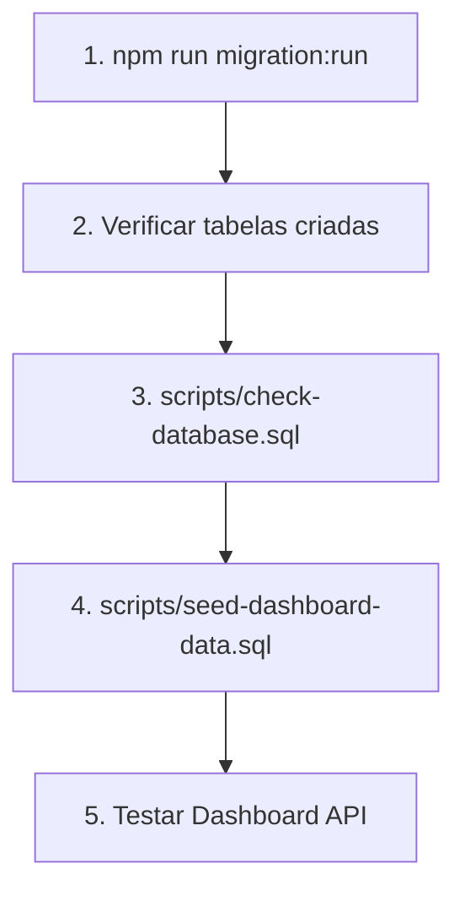

# 🚨 Solução Rápida - Erro "relação não existe"

## ❌ Problema
```
ERRO: relação "customers" não existe
ERRO: relação "drivers" não existe
ERRO: relação "vehicles" não existe
```

## ✅ Solução

### **Passo 1: Executar as Migrations**

As tabelas ainda não foram criadas no banco de dados. Execute:

```bash
# No diretório nexus-backend
cd c:\Users\franc\OneDrive\Documentos\NexusTransit\nexus-backend

# Executar migrations
npm run migration:run
```

ou

```bash
pnpm run migration:run
```

### **Passo 2: Verificar se as tabelas foram criadas**

```bash
# Conectar ao PostgreSQL
psql -U postgres -d nexus_transit

# Executar script de verificação
\i scripts/check-database.sql
```

### **Passo 3: Popular os dados**

Só DEPOIS que as migrations criarem as tabelas:

```bash
# No PostgreSQL (psql)
\i scripts/seed-dashboard-data.sql

# OU via linha de comando
psql -U postgres -d nexus_transit -f scripts/seed-dashboard-data.sql
```

---

## 🔍 Verificação Manual

Se quiser verificar manualmente:

```sql
-- Conectar ao banco
psql -U postgres -d nexus_transit

-- Listar todas as tabelas
\dt

-- Deve mostrar algo como:
-- customers
-- drivers  
-- vehicles
-- routes
-- deliveries
-- delivery_attempts
-- delivery_status_history
-- etc...
```

---

## 📋 Ordem Correta de Execução



### Comandos na ordem:

```bash
# 1. Criar tabelas
cd c:\Users\franc\OneDrive\Documentos\NexusTransit\nexus-backend
npm run migration:run

# 2. Conectar ao banco
psql -U postgres -d nexus_transit

# 3. Verificar tabelas (DENTRO do psql)
\i scripts/check-database.sql

# 4. Popular dados (DENTRO do psql)
\i scripts/seed-dashboard-data.sql

# 5. Sair do psql
\q

# 6. Testar API
npm run start:dev
# Acesse: http://localhost:3000/api/dashboard/overview?period=LAST_30_DAYS
```

---

## 🐛 Troubleshooting

### Se `npm run migration:run` falhar:

**1. Verifique se o banco existe:**
```bash
psql -U postgres -l | grep nexus
```

Se não existir:
```bash
psql -U postgres
CREATE DATABASE nexus_transit;
\q
```

**2. Verifique as configurações no `.env`:**
```env
DB_HOST=localhost
DB_PORT=5432
DB_USERNAME=postgres
DB_PASSWORD=sua_senha
DB_DATABASE=nexus_transit
```

**3. Verifique se o PostgreSQL está rodando:**
```bash
# Windows
Get-Service postgresql*

# Se não estiver rodando:
Start-Service postgresql-x64-14  # ou versão instalada
```

**4. Teste a conexão:**
```bash
psql -U postgres -h localhost -p 5432
```

---

## 📊 Estado Esperado Após Migrations

Você deve ter estas tabelas criadas:

```
✅ customers
✅ customer_addresses
✅ customer_contacts
✅ customer_preferences
✅ drivers
✅ driver_licenses
✅ driver_documents
✅ vehicles
✅ vehicle_maintenance
✅ vehicle_documents
✅ routes
✅ route_stops
✅ route_history
✅ deliveries
✅ delivery_attempts
✅ delivery_status_history
✅ delivery_proofs
✅ dashboard_snapshots
✅ audit_logs
✅ users
✅ roles
✅ user_roles
```

E mais de 40 migrations executadas em `nexus_migrations`.

---

## 💡 Dica Rápida

Se você acabou de fazer o pull do repositório, sempre execute as migrations primeiro:

```bash
git pull origin main
npm install          # instalar dependências se houver novas
npm run migration:run   # criar/atualizar tabelas
```

Só depois popule os dados de teste! 🎯
